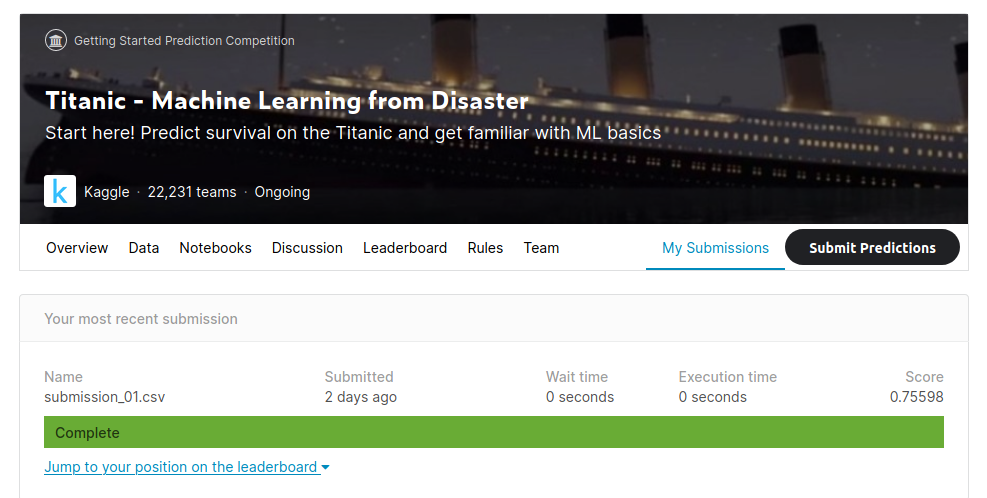

### Optional Titanic Competition

1. This assignment is 100% optional. This could be part of your portfolio. Please use the Holiday Break to work on whatever you feel will benefit you the most such as: 
    * This assignment. :-) 
    * Other programming projects. 
    * Catch up on previous assignments. 
    * Or take a much needed break.
2. Instructions for Getting Started
    1. Have fun and learn something!
    2. Head over to Kaggle and [sign up](https://www.kaggle.com/).
    3. Navigate to the [Titanic Competition](https://www.kaggle.com/c/titanic). NOTE: There are a few so use this link to get to the right one.
        1. You may be required to click to enter the competition and accept terms. 
        2. Download the `train.csv` and `test.csv` under the Data tab.
        3. Read the Data Overview and Description sections to know what each column actually means. 
3. Submissions 
    1. After entering the competition you can score your models by submitting a csv under `Data>Submit Predictions`. Please follow the guidelines outlined to format the csv. 

4. Gift Card Eligibility
    1. Amazon Gift Cards will be awarded to the team with the highest score. 
    2. To be eligible you must meet the following requirements: 
    3. Teams of 1-4 Students (self formed)
    4. Submit a link to your github notebook.
        * Must have a functioning notebook with model that outputs a predictions csv that can be scored by Kaggle. (Does not have to be your best model). 
        * Must include a screenshot of your best score. Like the one at the end of this file. Have this image file in your repo.
    5. The team(s) with the Highest accuracy score on Kaggle will receive gift cards. 
    6. Submission Deadline is 5:30pm the date of next class. 
    7. Must be your original work. 

    

### Tips for The Competition
1. Have fun and learn!
2. Read the Kaggle Data Descriptions to know what each column is.
3. Focus on one or two types of models. You won't have time to try them all. 
4. Get something scored as fast as you can. 
   * Then work on improvements. 
6. Once you've got a scored model look at the Discussion and other notebooks on Kaggle for inspiration and apply that knowledge.
7. If you are stuck reach out on Slack. We're here to help! 
